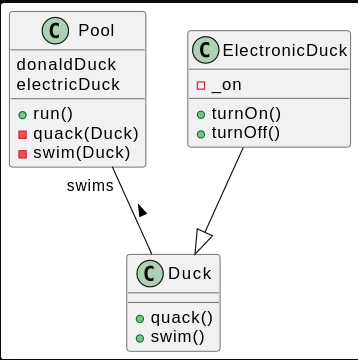
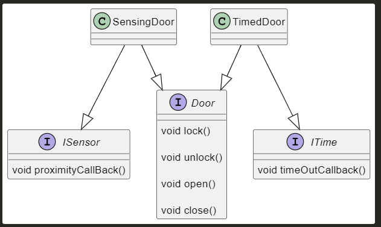

# SOLID LAB 1

<h2> I Introduction </h2>

<h2>II Les règles d'une bonne architecture logicielle </h2>

<h3> DIP </h3>

<h3> OCP : The Open/Closed Principle </h3>

_Probleme_
Dans notre exemple du RessourceAllocator, cette classe contient toutes les méthodes pour libérer, réserver, rechercher des slots libres mais l'allocation et la libération sont différent espour chacunes de ces methodes selon le type des ressources (TimeResource ou SpaceResource), ce qui augmente considérablement la taille de ces méthodes et rend la modification plus difficile.

De plus, on est en train de proposer des méthodes différentes pour la même fonctionnalité ( markTimeSlotFree et markSpaceSlotFree par exemple)

_Solution_

Construire une interface Resource contenant les methodes génériques pour chaque ressource et implémenter ces méthodes dans chaque type de Slot (TimeSlot/SpaceSlot) et utiliser seulement l'interface 'Resource' pour le traitement de Slots différents dans RessourceAllocator,on n'a plus besoin de l'énumération ResourceType

<h3> LSP : The LisKov Substitution Principle </h3>

_Probleme_

_Solution_

<h3> ISP : Interface Segregation Principle </h3>

_Probleme_

_Solution_

rédaction

<h3> DIP: Dependency Inversion Principle </h3>

_Probleme_

rédaction

_Solution_

rédaction

<h3> SRP: Single Responsability Principle  </h3>

_Probleme_

rédaction

_Solution_

rédaction

