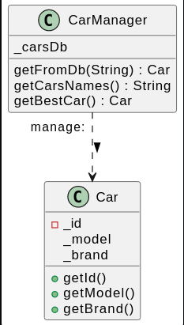

# SOLID LAB 1

<h2> I Introduction </h2>

Afin d'assurer le fonctionnement des logiciels dans les meilleures conditions et faciliter la mise à jour , la scalabilité et la lisibilité du code, on procède à appliquer des règles diverses qui aident à satisfaire les contraintes fonctionnelleset et répondre aux normes de l'industrie.

<h2>II Les règles d'une bonne architecture logicielle </h2>

<h3 style="color:#EFEFEF" > OCP : The Open/Closed Principle </h3>

_Probleme_

Dans notre exemple du RessourceAllocator, cette classe contient toutes les méthodes pour libérer, réserver, rechercher des slots libres mais l'allocation et la libération sont différent espour chacunes de ces methodes selon le type des ressources (TimeResource ou SpaceResource), ce qui augmente considérablement la taille de ces méthodes et rend la modification plus difficile.

De plus, on est en train de proposer des méthodes différentes pour la même fonctionnalité ( markTimeSlotFree et markSpaceSlotFree par exemple)

_Solution_

Construire une interface Resource contenant les methodes génériques pour chaque ressource et implémenter ces méthodes dans chaque type de Slot (TimeSlot/SpaceSlot) et utiliser seulement l'interface 'Resource' pour le traitement de Slots différents dans RessourceAllocator,on n'a plus besoin de l'énumération ResourceType

<h3> LSP : The LisKov Substitution Principle </h3>

_Probleme_

Le problem dans cette implémentation est que nous devons utiliser des if et des else partout dans notre code pour réaliser un traitement sur mesure pour chaque nouvelle classe qui implémente l'interface principlae ce qui fait que notre code ne serait plus maintenable.

_Solution_

Dans cet exemple,le probleme est que donald duck et electric duck ont des methodes en communs mais electric duck a queleques methodes specifiques. Pour avoir une bonne architecture, on a besoin de créer une interface pour la class duck et une autre héritant de duck ( electrique duck ) contentant les methodes spécifique a electrique ( turn on and off ).

<h3  style="color:#EFEFEF" > ISP : Interface Segregation Principle </h3>

_Probleme_

Ici, on a beaucoup de classes concrètes différentes héritant d'une seule interface contenant des méthodes implémentées par quelques clases et d'autres qui ne fasses rien du tout. Ce ci va engendrer du code inutile.

_Solution_

Pour remédier a ce probléme, on fait recours a l'ISP, puisque timeOutCallback et implémenté par timedDoor et proximityCallBack est implémenté par sensingDoor, on crée 2 nouvelles interfaces ISensor et Itimer héritant chacune l'une et l'autre.
Maintenant, TimedDoor implémente Door et Itime et Isensor implémente Isensor en plus que Door. Ainsi, notre code et plus facilement extensible et plus maintenable.

<h3  style="color:#EFEFEF" > DIP: Dependency Inversion Principle </h3>

_Probleme_

Le problème ici est que le EncodingModule est un peu déroutant. EncodeWithFiles() et encodeBasedOnNetworkAndDatabase() sont trés différents et devraient être implémentés différemment. Par example, seul la 2éme fonction utilise MyDatabase.

_Solution_

Pour remédier à ce probleme, on éclate le encoding module grâce au DIP. Dans ce cas, on a une interface Encoder contenat la méthode encode. et 2 classes concrete fileEncoder and DatabaseEncoderAndNetwork. maintenant, seul DatabaseEncoder est en relation avec myDatabase.

<h3  style="color:#EFEFEF" > SRP: Single Responsability Principle  </h3>

_Probleme_

Ici, la class CarManager implémente toutes les méthodes ce qui n'est pas vraiment une bonne pratique pour les classes Managers,Ils doivent seulement gérer la logique métier et non pas la . nous devrons distribué les taches selon leur intéret.

_Solution_

On utilisant la SRP, on a maintenant séparé carManager en 3 classes principales carDb implémentant toutes méthodes en relation directe avec la base de donné, carNamesList qui gére la liste des voiture selectioné. et car Assessment implémentant des méthodes permetant d'avoir une idée sur l'état des voitures. Dans ce cas, toutes classe a une seul responsabilité.

